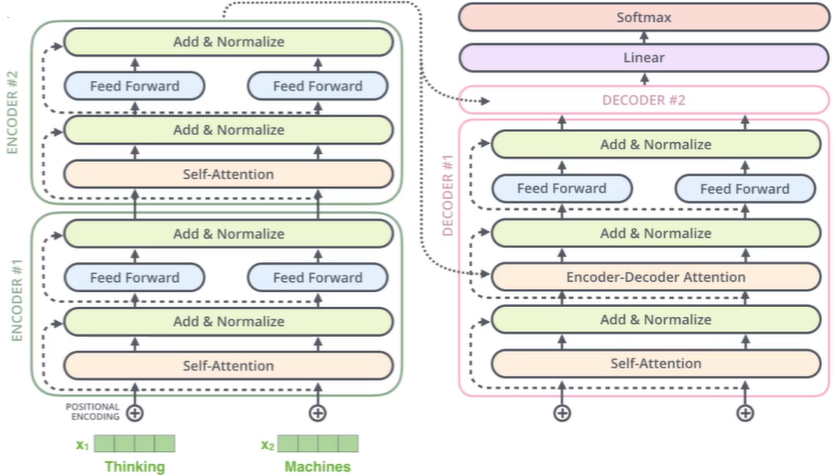
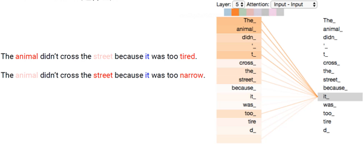

###  NLP通用框架BERT原理解读

#### 传统解决方案遇到的问题

传统的RNN网络

- 训练速度：无法加速训练，并行等
- Self-Attention机制（注意力），一段话中，不是每个词都重要，我们只需要关注重要的部分。如：下班后我们一起去吃饭吧，我听说有家面馆挺好吃的，我请客。是不是对于听的人来说主要是“我请客”。

- word2vec：训练好词向量就永久不变了，不同的语境相同的词相同的向量，但这合理吗？就想我们在生气的时候说傻子，很开心的时候说傻子，意思是完全不一样的，

#### Transformer整体架构如下

#### 注意力机制的作用

- 对于输入的数据，我们的关注点是什么？
- 如何才能让计算机关注到这些有价值的信息？

> 如上，传入一段文本，如果我们没有强调注意什么，那么词向量结果可能是平行的，如果我们强调“eating”，那么“eating”这个词的词向量就会有所不同。

如果是人为的加权，告诉计算机哪个重要，这显然是不合实际的，应该让计算机自己发现哪些重要。

> “it”在第一句中是指代“animal”，表示它太累了没有过去。
>
> “it”在第二句中指代“street”，表示路太窄了没有过去。