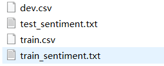
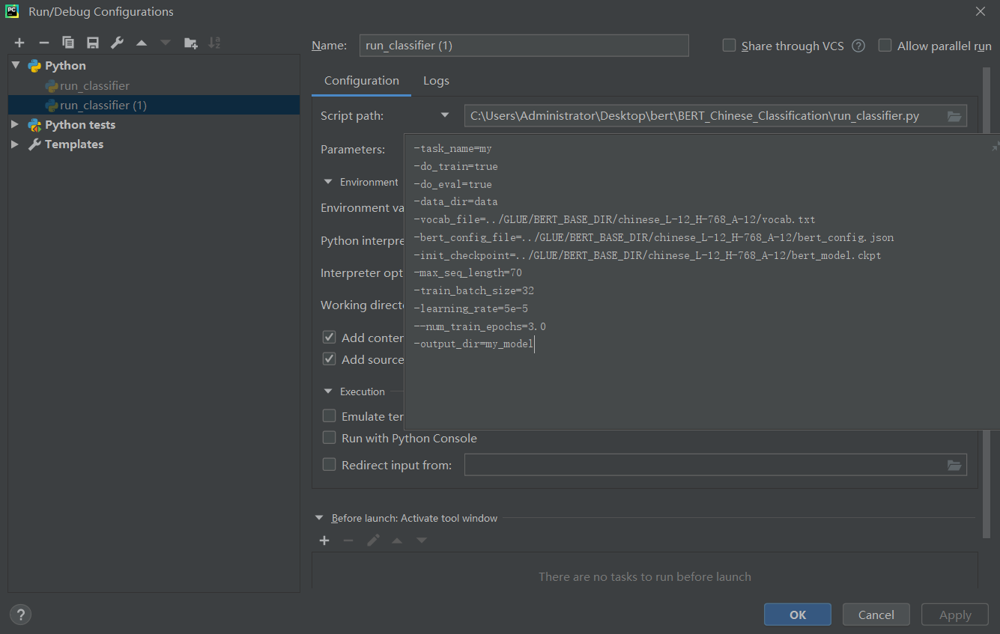
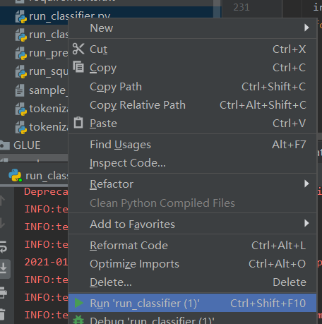

### 第三章——基于BERT的中文情感分析实战

#### 任务介绍

对中文进行分类demo，分成0/1/2

我们使用的是Google官方开源的中文BERT预训练模型

> vocab.txt里把常用的中文基本覆盖了

#### 读取处理自己的数据集

~~~python
class MyDataProcessor(object):
  """Base class for data converters for sequence classification data sets."""

  def get_train_examples(self, data_dir):
    """Gets a collection of `InputExample`s for the train set."""
    raise NotImplementedError()

  def get_dev_examples(self, data_dir):
    """Gets a collection of `InputExample`s for the dev set."""
    raise NotImplementedError()

  def get_test_examples(self, data_dir):
    """Gets a collection of `InputExample`s for prediction."""
    raise NotImplementedError()

  def get_labels(self):
    """Gets the list of labels for this data set."""
    raise NotImplementedError()
~~~

> 这是完全照搬class DataProcessor的类，只是类名改成MyDataProcessor

**读取数据的类get_train_examples**

~~~python
class MyDataProcessor(DataProcessor):
  """Base class for data converters for sequence classification data sets."""

  def get_train_examples(self, data_dir):
    """Gets a collection of `InputExample`s for the train set."""
    file_path = os.path.join(data_dir, 'train_sentiment.txt')
    f = open(file_path, 'r', encoding='utf-8')  # 读取数据，并指定中文常用的utf-8
    train_data = []
    index = 0  # ID值
    for line in f.readlines():  # 参考XnliProcessor
        guid = "train-%d" % index
        line = line.replace('\n', '').split('\t')  # 处理换行符，原数据是以tab分割
        text_a = tokenization.convert_to_unicode(str(line[1]))  # 第0位置是索引，第1位置才是数据，可以查看train_sentiment.txt
        label = str(line[2])  # 我们的label里没有什么东西，只有数值，所以转字符串即可
        train_data.append(
            InputExample(guid=guid, text_a=text_a, text_b=None, label=label))  # 这里我们没text_b，所以传入None
        index += 1  # index每次不一样，所以加等于1
    return train_data  # 这样数据就读取完成
~~~

> 参照XnliProcessor

~~~python
class XnliProcessor(DataProcessor):
  """Processor for the XNLI data set."""

  def __init__(self):
    self.language = "zh"

  def get_train_examples(self, data_dir):
    """See base class."""
    lines = self._read_tsv(
        os.path.join(data_dir, "multinli",
                     "multinli.train.%s.tsv" % self.language))
    examples = []
    for (i, line) in enumerate(lines):
      if i == 0:
        continue
      guid = "train-%d" % (i)  # 获取样本ID
      text_a = tokenization.convert_to_unicode(line[0])
      text_b = tokenization.convert_to_unicode(line[1])  # 获取text_a和b，我们只有a所以把b去掉
      label = tokenization.convert_to_unicode(line[2])  # 获取标签
      if label == tokenization.convert_to_unicode("contradictory"):
        label = tokenization.convert_to_unicode("contradiction")
      examples.append(
          InputExample(guid=guid, text_a=text_a, text_b=text_b, label=label))  # 把读进来的东西传到InputExample，这个类可以点进去，里面什么都没做，只不过是模板，我们也照着做
    return examples
~~~

**获取label**

~~~
# 也是参考XnliProcessor，把return改成0，1，2即可
  def get_labels(self):
    """Gets the list of labels for this data set."""
    return ["0", "1", "2"]
~~~

**以下是完整的**

~~~python
class MyDataProcessor(DataProcessor):
  """Base class for data converters for sequence classification data sets."""

  def get_train_examples(self, data_dir):
    """Gets a collection of `InputExample`s for the train set."""
    file_path = os.path.join(data_dir, 'train_sentiment.txt')
    f = open(file_path, 'r', encoding='utf-8')  # 读取数据，并指定中文常用的utf-8
    train_data = []
    index = 0  # ID值
    for line in f.readlines():  # 参考XnliProcessor
        guid = "train-%d" % index
        line = line.replace("\n", "").split("\t")  # 处理换行符，原数据是以tab分割
        text_a = tokenization.convert_to_unicode(str(line[1]))  # 第0位置是索引，第1位置才是数据，可以查看train_sentiment.txt
        label = str(line[2])  # 我们的label里没有什么东西，只有数值，所以转字符串即可
        train_data.append(
            InputExample(guid=guid, text_a=text_a, text_b=None, label=label))  # 这里我们没text_b，所以传入None
        index += 1  # index每次不一样，所以加等于1
    return train_data  # 这样数据就读取完成

  def get_dev_examples(self, data_dir):
    """Gets a collection of `InputExample`s for the dev set."""
    file_path = os.path.join(data_dir, 'test_sentiment.txt')
    f = open(file_path, 'r', encoding='utf-8')
    dev_data = []
    index = 0
    for line in f.readlines():
        guid = "dev-%d" % index
        line = line.replace('\n', '').split('\t')
        text_a = tokenization.convert_to_unicode(str(line[1]))
        label = str(line[2])
        dev_data.append(
            InputExample(guid=guid, text_a=text_a, text_b=None, label=label))
        index += 1
    return dev_data

  def get_test_examples(self, data_dir):
    """Gets a collection of `InputExample`s for prediction."""
    file_path = os.path.join(data_dir, 'test.csv')
    f = open(file_path, 'r', encoding='utf-8')
    test_data = []
    index = 0
    for line in f.readlines():
        guid = "test-%d" % index
        line = line.replace('\n', '').split('\t')
        text_a = tokenization.convert_to_unicode(str(line[0]))
        label = str(line[1])
        test_data.append(
            InputExample(guid=guid, text_a=text_a, text_b=None, label=label))
        index += 1
    return test_data

  def get_labels(self):
    """Gets the list of labels for this data set."""
    return ["0", "1", "2"]  # 参考XnliProcessor，改成返回0，1，2
~~~

#### 训练BERT中文分类模型

main函数增加运行内容

~~~python
def main(_):
  tf.logging.set_verbosity(tf.logging.INFO)

  processors = {
      "cola": ColaProcessor,
      "mnli": MnliProcessor,
      "mrpc": MrpcProcessor,
      "xnli": XnliProcessor,
      'my':MyDataProcessor,  # 这是增加的部分，这样运行参数task_name才能对应上
  }
~~~

参数

~~~
-task_name=my
-do_train=true
-do_eval=true
-data_dir=data
-vocab_file=../GLUE/BERT_BASE_DIR/chinese_L-12_H-768_A-12/vocab.txt
-bert_config_file=../GLUE/BERT_BASE_DIR/chinese_L-12_H-768_A-12/bert_config.json
-init_checkpoint=../GLUE/BERT_BASE_DIR/chinese_L-12_H-768_A-12/bert_model.ckpt
-max_seq_length=70
-train_batch_size=32
-learning_rate=5e-5
--num_train_epochs=3.0
-output_dir=my_model
~~~

> task_name：运行的模块，在main里指定了名字对应的类
>
> do_train：是否训练
>
> do_eval：是否验证
>
> data_dir：数据地址
>
> vocab_file：词库表
>
> bert_config_file：bert参数
>
> init_checkpoint：初始化参数
>
> max_seq_length：最长字符限制
>
> train_batch_size：训练次数
>
> learning_rate：学习率
>
> num_train_epochs：循环训练次数
>
> output_dir：输出路径

设置参数完成，run即可

