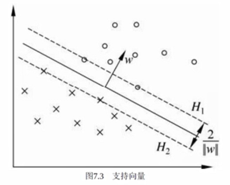
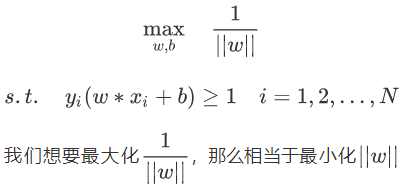
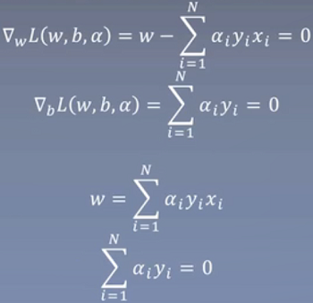
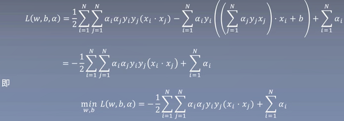
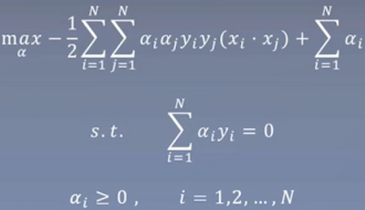

# 7.支持向量机——升维打击

Support vector machines

### 知识树

Knowledge tree

> 支持向量机也是李航的统计学习中效果最好的模型，面试中也是问的最多的
>
> 苹果表示重点
>
> 间隔：使用了几何间隔，保证w b的度量，感知机则是函数间隔
>
> 间隔最大化思想：则是支持向量机的独有，这使得它找到最优超平面
>
> 核函数：面试当中可能会问到是否能写出其中的一个核函数

### 红豆绿豆的前世今生

前面章节讲到划分超平面，来区分红豆和绿豆

> 从上面可以看到，能找到很多的超平面，黄色的线，那哪条黄色的线才是最好的呢？当然是对角的黄色线，因为这条可以让红豆绿豆区分的最开，也就是线和豆的距离最远，即使区分新的豆（预测集），也能最好的区分开，因为可能豆有接近的情况。

**如何找到最优的超平面**

> 从上图可知，超平面A是最优的。因为它与两个类的距离都足够大。

结论：我们试图找到一个超平面，这个超平面可以使得与它最近的样本点的距离必须大于其他所有超平面划分时与最近的样本点的距离。

在SVM中，这叫间隔最大化。

> 即该超平面与最近的样本点的距离，都大于所有超平面离最近样本点的距离

此时我们可以说，我们找到了最优的超平面，但随着时代的变迁，红豆绿豆也发生了变化，比如下图的

> 它不再是左右分开，而是混在一起

> 单纯用线性无法解决，如果是非线性呢？

> 我们需要找到这么个圈的超平面，那么圈能是超平面呢？

> 如上图，原本二维空间的样本，因为线性不可分， 即需要投射到三维空间，那么在三维空间就能用超平面切分。
>
> 再将三维空间的超平面投射到二维空间，那么超平面在二维空间上就是曲线的，即非线性。

那么接下来，我们要考虑的是，怎么进行低维和高维之间的转换。

### 升维可分问题

1. 当有人拿着棍子指着你时，你只能看到棍子的横截面，是一个点，它是一维的。我们无法将两个点区分开来。因为她们重叠了。

   

   > 右边红色线表示看的方向

2. 当有人拿着棍子指着其它地方，我们能看到整个棍子，这时候是二维的。我们可以一把刀劈开，把红豆和绿豆区分开。所以，红豆和绿豆虽然在一维的时候不能分开，但在二维时线性可分了。

   

3. 也可能二维不可分， 如下图

   

4. 这时候我们可以把棍子看作三维中的棍子，有体积的。如果把棍子立在地上，很有可能红豆靠南侧，绿豆靠北侧，我们像劈柴一样从上至下即可劈开（分开），也一样是线性可分。

5. 如果三维还不能线性可分，那就升到思维

**总会从某一个维度开始，它变成线性可分了，即只要不断的增加维度（特征）总能区分开来**

同时，我们发现高维中的超平面，映射到低维空间中时，可能会变成曲线或其它的划分形式。

这也就是为什么，在SVM中我们同样使用超平面来划分，SVM可以划分非线性的数据集。

它本质上仍然是线性超平面，不过是高维中的线性超平面。

**那么升维一定会线性可分吗？**

**会不会升到无穷维了仍然线性不可分？**

答案是不会的，首先要明白，我们的数据集一定是基于真实的某种分布，分为A类的样本和B类的一定在本质上有区别。只要有区别，就一定可以区分开来，一定在某个高维度上线性可分。

**另外，总能上升到有个维度空间中线性可分，无限上升的同时有没有可能在N+1维度又不可分了？**

不会，随着维度的上升，我们获得的信息越来越多。当第N维的数据已经足够划分时，更多的信息量并不会出现又不可分的情况。

### 总结

Summarization

1. SVM使用间隔最大化思想构造最优超平面。
2. 构造出来的超平面使得其与最近的点的距离最大。
3. SVM也可划分非线性数据集。
4. 它通过高维中的线性超平面再低维中的投影来完成非线性的划分。因此从直观上来讲，我们的模型必定有一个升维的操作。
5. 这是总体的概念。

### 支持向量机

Support vector machines

函数间隔：

几何间隔：

这里使用的是几何间隔，前面讲到这里就不重复了

**最大间隔分离超平面：**

目前讲的是线性超平面

> 图中心，虚线到实线的距离我们称之为γ，我们要做的是最大化γ，使得这个超平面调整为γ的一个最大值，等价于找到了最优的超平面

**式子如下：**

> γ：表示几何间隔
>
> s.t. 表示约束
>
> yi：正负1。保证算出来的数始终是大于0的，如上图中“圈”表示+1的样本“×”表示负一的样本，那么某个“圈”是正数，乘以上方的yi（正数），正正得正，某个点“×”是负数，乘以下方的yi（负数），负负得正。

**简化上方的式子：**

我们知道max的γ是几何间隔，那么我们变换一下
$$
\frac{\hat{γ}}{||w||} 其中，\hat{γ}表示函数间隔，除以w二范数就是几何间隔了。
$$

$$
既然我们最终是\frac{\hat{γ}}{||w||} ，那么式子我们可以简化成
$$

max的时候是几何间隔，也就是最终s.t. 还是会约束着它朝着几何间隔去走，但是这样的好处就是下方的||w||就没有了

**简化后如下：**

之前我们说过，对于函数间隔，我们等比例放大缩小w、b可以让最终结果变成1，也就是γ=1

**再简化后：**

$$
后面要用到拉格朗日乘子法，我们把\frac{1}{||w||}变成\frac{1}{2}||w||^2，这两者是等价的
$$

**再简化后：**

$$
\min_{w,b} \quad \frac{1}{2}||w||^2
$$

$$
s.t.\quad y_i(w*x_i+b)-1≥0 \quad i=1,2,...,N
$$

> 利用拉格朗日乘子法，推导成如下式子

$$
L(w,b,α)=\quad \frac{1}{2}||w||^2-\sum^N_{i=1}α_iy_i(w*x_i+b)+\sum^N_{i=1}α_i
$$

$$
目标：\min_{w,b}\max_aL(w,b,α)
$$

$$
转换成：\max_a\min_{w,b}L(w,b,α)
$$

将拉格朗日函数L(w,b,α)分别对w,b求偏导并令其等于0

进行推导

2.求minL(w,b,α)对α的极大，即是对偶问题

3.求max转换成min：

接下来就是求解α的问题了

