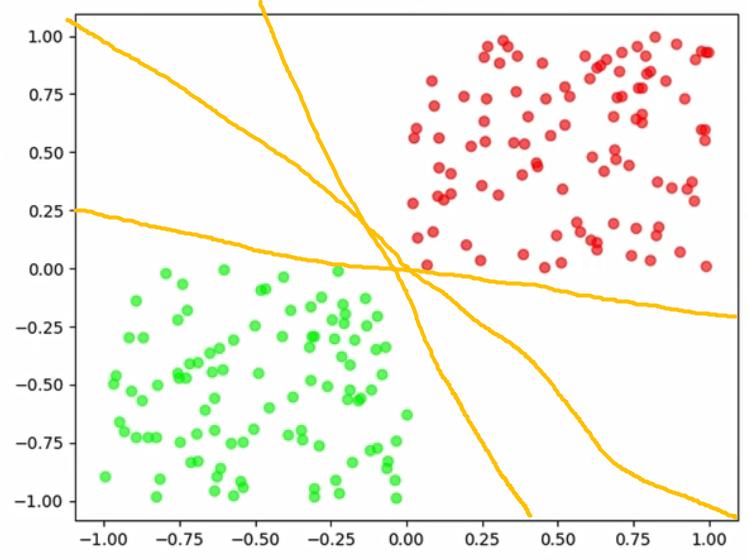
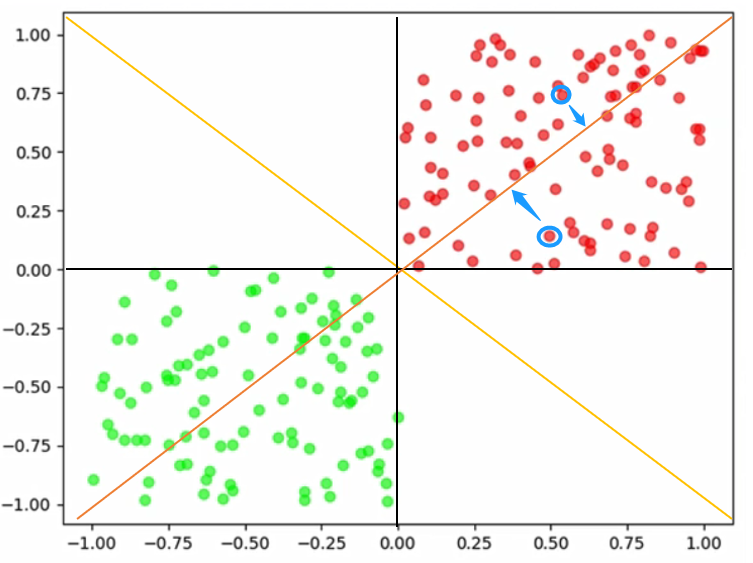

# 2.感知机——入门的垫脚石

### 概述

每个算法都是为了解决一类问题，或者说解决之前的问题所创造出来的，而感知机，在解决一类问题的时候也暴露了很多问题，变相的推动了以后的算法的改进方向。

### 知识树

> 苹果表示相对重要的

### 直观介绍

现在有一盘红豆和绿豆，怎么把红豆和绿豆分开来

> 当红豆和绿豆放在一起时，它们却能自己分开来，为什么呢？

我们怎么区分呢，假设我们随意花如下的线

> 这样是不是就完美的区分开来了，完美解决。
>
> 那么程序怎么知道x和y都大于0的豆是红豆呢？
>
> 或者说，它是怎么学会这个规则的？

那是不是只要一条直线不分错一个点，或者说尽可能的少分错点，那就是一条好的直线。

即：我们把所有分错的点和直线的距离的和（蓝色示例），求和的距离最小表示这条直线越好，因为这表示这条线分错的最少。

> 如图中红色线的和的距离肯定比黑色或者黄色的线大。

