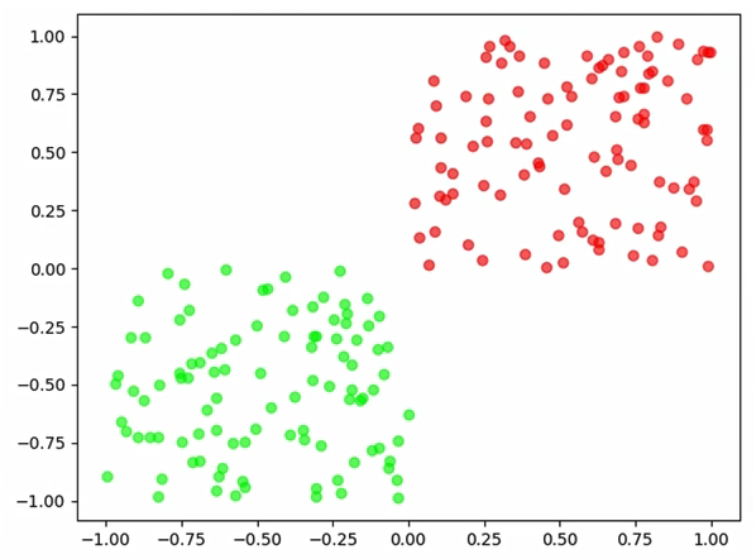
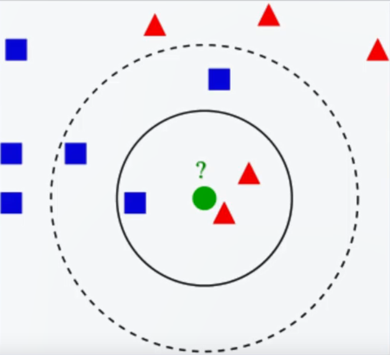
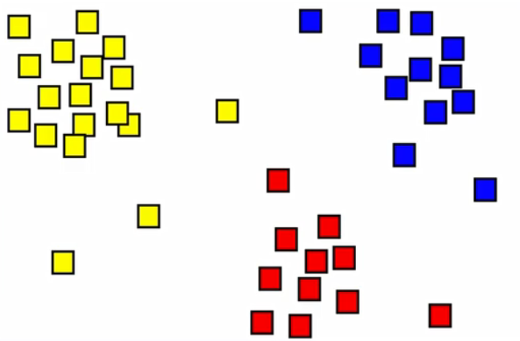

# 3.K近邻——物以类聚

K-nearest neighbor

### 知识树

### 怎么区分红豆绿豆？

How to distinguish red beans and green beans?

之前我们构造了一个超平面来解决这个问题，既然超平面可以切分，是不是红豆之间和绿豆之间有着某种关联。即：物以类聚。

如果一个豆过来自然而然的到红豆堆，我们有理由认为它大概率是红豆。

1. 同一标签的样本通常有很多相似的特征。
2. 没进来一个样本，查看它周边的样本是什么类别，那么它就很有可能属于该类别。

那么某个点与其它点距离怎么计算。

### 距离度量

Distance measure

首先令

度量的方法有：

欧式距离（也称二范数）：

> xi里的x减去对应位置的xj里的x，然后全部平方，再求和，然后开根号。
>
> 如果两个点之间的距离很远，那么值就会很大

曼哈顿距离（也称一范数/也称城市街区距离）：

> 相对上面欧式距离，不需要平方-相加-开根号，只要拿它的绝对值-相加即可

P范数：

> 引出P范数，p=1则是一范数，p=2则是二范数

还有3范数（也称切比雪夫距离/棋盘距离）

最常用的是欧式距离>曼哈顿距离>切比雪夫距离

### 总结

Summarization

1. K近邻思想：物以类聚
2. K近邻没有显式的训练过程
   1. 不需要先训练再预测，直接得到结果
3. 距离度量
   1. 欧式距离：两点之间直线
   2. 曼哈顿距离：城市街区距离
   3. 切比雪夫距离：棋盘距离

### K值的选择

How to chose K

**选择较小的K值**

​	用较小的邻域进行预测。预测结果对邻近的实例点非常敏感。如果邻近的实例点恰好是噪声，预测就会出错。

**选择较大的K值**：

​	用较大的邻域进行预测。对于输入实例较远（已经不太相似）的样本点也会对预测起作用，使预测发生错误。

**在应用中**：

​	先取一个较小的K值，再通过交叉验证法来选取最优的K值

### 分数表决规则

Majority voting rule

分类决策规则：多数表决

损失函数：

实心圆内都判断为红色的损失值

实心圆内都判断为蓝色的损失值

### K近邻算法

K-nearest neighbor

输入：训练数据T = [(x1, y1),...,(xn,yn)]

实例特征向量x。

1. 根据给定的距离度量，在训练集中找到与x最近的k个点，涵盖这k个点的邻域记作Nk(x)

2. 在Nk(x)中根据分类决策规则（如多少表决）决定x的类别y

   输出实例x所属的类别y

### 总结

Summarization

1. K近邻的思想：物以类聚
2. K近邻没有显式的训练过场
3. 距离度量：欧式距离、曼哈顿距离、切比雪夫距离
4. 分类方式：多数表决规则