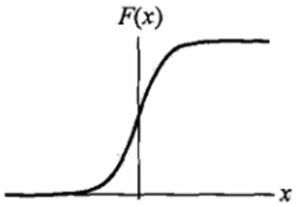
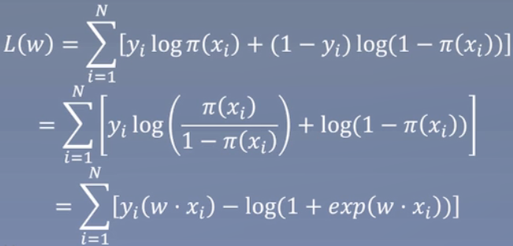

# 6.逻辑斯蒂回归与最大熵

### 知识树

Knowledge tree

相较前面的算法，性能更好，也更符合工业场景

### 一个逻辑斯蒂回归回归的故事

A story about the Logistic regression

1. 之前的f(x) = sign(w*x+b)只输出+1和-1，这样的判别方式真的有效吗？
2. 超平面左侧0.001距离的点和超平面右侧0.001距离的点真的有天壤之别吗？

> 如上面两个黑点，明明只差分毫，却变成了+1或者-1。这也是感知机的缺陷

**我们想要解决的：**

1. 怎么解决极小距离带来的+1和-1的天壤之别
2. 怎么让最终的预测式子连续可微

### 逻辑斯蒂回归

Logistic regression

> 连续可微
>
> 可输出概率

**参数估计：**

由上面的式子可知，里面参数只有w和x，x为已知的特征，也就是更新w即可

逻辑斯蒂回归模型学习时，对于给定的训练数据集T={(x1,y1), (x2,y2), ...,(xn,yn)}，可以应用极大似然估计法估计模型参数，从而得到逻辑斯蒂回归模型。

设：

> Y=1和Y=0相加时为1，所以当Y=1=π(x)，那么Y=0就等于1-π(x)

似然函数为

> 当前的条件做连乘，变换成log则是相加

对数似然函数为

对L(w)求极大值，得到w的估计值

**似然函数对w求导：**

### 总结

Summarization

1. 逻辑斯蒂以输出概率的形式解决了极小距离带来的+1和-1的天壤之别，同时概率也可作为模型输出的置信程度。
2. 逻辑斯蒂使得了最终的模型函数连续可微，训练目标与预测目标达成一致。
3. 逻辑斯蒂采用了较大似然估计来估计参数。

### 一个最大熵的小故事

A story about the Maximum entropy model

