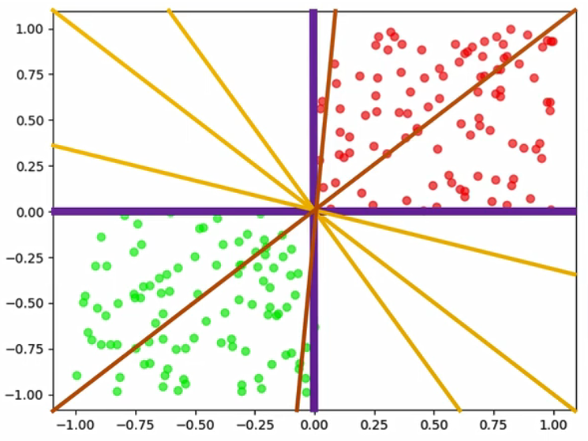
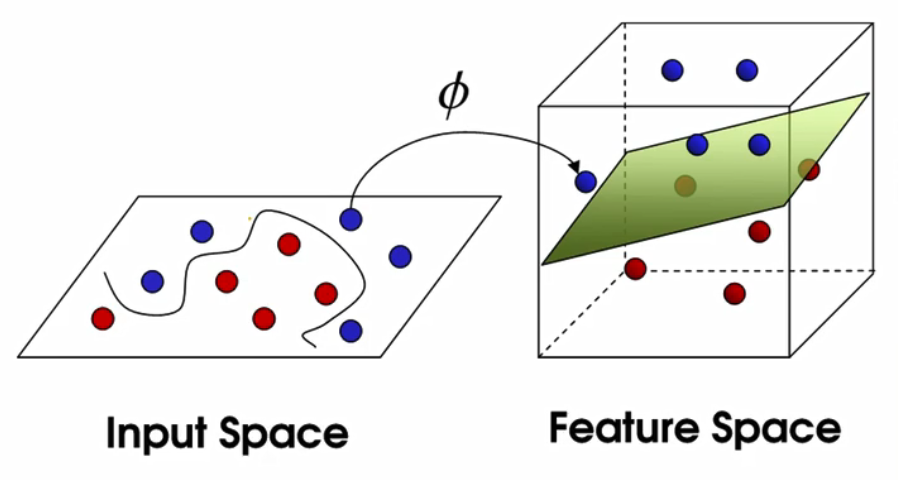

# 7.支持向量机

Support vector machines

### 知识树

Knowledge tree

> 支持向量机也是李航的统计学习中效果最好的模型，面试中也是问的最多的
>
> 苹果表示重点
>
> 间隔：使用了几何间隔，保证w b的度量，感知机则是函数间隔
>
> 间隔最大化思想：则是支持向量机的独有，这使得它找到最优超平面
>
> 核函数：面试当中可能会问到是否能写出其中的一个核函数

### 红豆绿豆的前世今生

前面章节讲到划分超平面，来区分红豆和绿豆

> 从上面可以看到，能找到很多的超平面，黄色的线，那哪条黄色的线才是最好的呢？当然是对角的黄色线，因为这条可以让红豆绿豆区分的最开，也就是线和豆的距离最远，即使区分新的豆（预测集），也能最好的区分开，因为可能豆有接近的情况。

**如何找到最优的超平面**

> 从上图可知，超平面A是最优的。因为它与两个类的距离都足够大。

结论：我们试图找到一个超平面，这个超平面可以使得与它最近的样本点的距离必须大于其他所有超平面划分时与最近的样本点的距离。

在SVM中，这叫间隔最大化。

> 即该超平面与最近的样本点的距离，都大于所有超平面离最近样本点的距离

此时我们可以说，我们找到了最优的超平面，但随着时代的变迁，红豆绿豆也发生了变化，比如下图的

> 它不再是左右分开，而是混在一起

> 单纯用线性无法解决，如果是非线性呢？

> 我们需要找到这么个圈的超平面，那么圈能是超平面呢？

> 如上图，原本二维空间的样本，因为线性不可分， 即需要投射到三维空间，那么在三维空间就能用超平面切分。
>
> 再将三维空间的超平面投射到二维空间，那么超平面在二维空间上就是曲线的，即非线性。

那么接下来，我们要考虑的是，怎么进行低维和高维之间的转换。

### 多维

