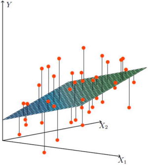

# 1. 线性回归原理

### 线性回归概述

#### 例子：

- 数据：工资和年龄（两个特征）
- 目标：预测银行会贷款给我多少钱（标签）
- 考虑：工资和年龄都会影响最终银行贷款的结果，那么它们各自有多大的影响被？（参数）

| 工资 X1 | 年龄 X2 | 额度 Y |
| ------- | ------- | ------ |
| 4000    | 25      | 20000  |
| 8000    | 30      | 70000  |
| 7500    | 33      | 50000  |

其中工资、年龄是特征，用来预测额度，而我们不可能直接拿工资 × 年龄，因为明显工资更重要些，那么可能建成的方程是 Y = (X1 × θ1) × (X2 × θ1)，其中θ就是各种特征的权重，那么最终我们要求解的就是各种的θ。

而线性回归就说得到每个数据最终的预测Y（具体的值），除了回归还有分类，分类是离散型的0/1等固定值的分类。

### 通俗理解

- X1，X2就是我们的两个特征工资和年龄，Y是银行最终会借给我们额度
- 找到最合适的一条线，来拟合我们的数据点

> 红色的点是数据，即前面的特征等

当前的数据是线性的，也就是数据不能映射在同一个平面。那么 Y = (X1 × θ1) × (X2 × θ1)就不能覆盖所有的点进行计算。怎么样解决这个问题，或者说如果我们能尽可能的满足绝大多数数据点，是否就可以了呢。

### 误差项定义

#### 数据公式

接着上面的问题，什么样的平面才是最合理最满足的呢

- 假设 θ1是工资的参数， θ2是年龄的参数
- 拟合的平面：h θ(x) =  θ0 +  θ1X1 +  θ2X2
  - θ0是偏置项，不管θ1和θ2等什么变化，θ0的变化会影响平面向上或者向下浮动，对结果做微调
  - 上面的方程可能无法形成矩阵相乘的形式，因为θ0没有X0，我们可以添加一个不影响整体的X0，以达到矩阵相乘的效果
- 整合：

#### 误差

- 真实值和预测值之间肯定要存在差异的（用ε来表示该误差）

- 对于每个样本：

  > y表示真实值，（第二项）表示预测值，ε表示误差值，即预测值和真实值之间有一个误差项，其中 i 表示每个样本之间都有自己的真实值、预测值、误差项

误差项越小，代表预测的越准确。
