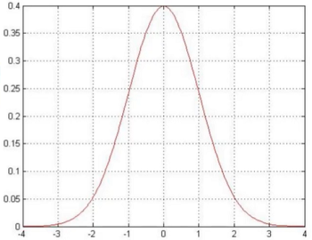

# 1. 线性回归原理

### 线性回归概述

#### 例子：

- 数据：工资和年龄（两个特征）
- 目标：预测银行会贷款给我多少钱（标签）
- 考虑：工资和年龄都会影响最终银行贷款的结果，那么它们各自有多大的影响被？（参数）

| 工资 X1 | 年龄 X2 | 额度 Y |
| ------- | ------- | ------ |
| 4000    | 25      | 20000  |
| 8000    | 30      | 70000  |
| 7500    | 33      | 50000  |

其中工资、年龄是特征，用来预测额度，而我们不可能直接拿工资 × 年龄，因为明显工资更重要些，那么可能建成的方程是 Y = (X1 × θ1) × (X2 × θ1)，其中θ就是各种特征的权重，那么最终我们要求解的就是各种的θ。

而线性回归就说得到每个数据最终的预测Y（具体的值），除了回归还有分类，分类是离散型的0/1等固定值的分类。

### 通俗理解

- X1，X2就是我们的两个特征工资和年龄，Y是银行最终会借给我们额度
- 找到最合适的一条线，来拟合我们的数据点

> 红色的点是数据，即前面的特征等

当前的数据是线性的，也就是数据不能映射在同一个平面。那么 Y = (X1 × θ1) × (X2 × θ1)就不能覆盖所有的点进行计算。怎么样解决这个问题，或者说如果我们能尽可能的满足绝大多数数据点，是否就可以了呢。

### 误差

#### 误差项公式

接着上面的问题，什么样的平面才是最合理最满足的呢

- 假设 θ1是工资的参数， θ2是年龄的参数
- 拟合的平面：h θ(x) =  θ0 +  θ1X1 +  θ2X2
  - θ0是偏置项，不管θ1和θ2等什么变化，θ0的变化会影响平面向上或者向下浮动，对结果做微调
  - 上面的方程可能无法形成矩阵相乘的形式，因为θ0没有X0，我们可以添加一个不影响整体的X0，以达到矩阵相乘的效果
- 整合：

- 真实值和预测值之间肯定要存在差异的（用ε来表示该误差）

- 对于每个样本：

  > y表示真实值，（第二项）表示预测值，ε表示误差值，即预测值和真实值之间有一个误差项，其中 i 表示每个样本之间都有自己的真实值、预测值、误差项

误差项越小，代表预测的越准确。

#### 独立同分布的意义

- 误差 ε(i) 是独立且具有相同的分布，并服从均值为0方差为θ平方的高斯分布

  > 我们拆开上面的话

  - 独立：小明和小红一起来贷款，他们没关系
  - 同分布：他们都是去同一个银行
  - 高斯分布：银行可能会多给，也可能会少给，但绝大多数情况下这个浮动不会太大，极小情况下浮动会比较大，符合正常情况

  

  现实中也很难有绝对的高斯分布，大多数是近似高斯分布，也就是我们算法推导的时候也很难得到一个完全正确的答案，只有最接近的答案，也就是存在误差。

#### 似然函数的作用

- 预测值与误差（1）：

  > y是真实值、x是预测值、ε误差值，现在我们要求的就是θ，它应该怎么求解

- 由于误差服从高斯分布（2）：

  > 高斯分布的公式，这里我们要求的是θ，所以把θ移动到左边，变成y - θX = ε，即演变成

- 将（1）式带入（2）式：

  > 这里我们希望左边的x和θ组合完后，和真实值y越解决越好，即成为y的可能性越大越好

- 似然函数：

  解释：什么样的参数跟我们的数据组合后恰好是真实值

- 对数似然：

  解释：乘法难解，加法就容易了，对数里乘法可以转换成加法

  - 展开化简：

  - 目标：让似然函数（对数变换后也一样）越大越好

    （最小二乘法）

#### 参数求解

- 目标函数：
- 求偏导：
- 偏导等于0：

