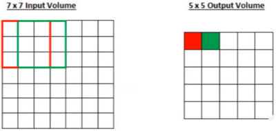
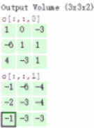

### 第三章——卷积神经网络

#### 卷积神经网络应用领域

CV领域发展：

> 比赛中预测错误率的百分比，每年逐步下降。Human是人类肉眼的识别能力，2016年开始已经远高于人类肉眼死别能力，后面就取消了该方向的比赛了。

检测任务：

分类与检索：

> 分类：将图片分到对应类别。
>
> 检索：找到相似的图片。

还有图片重构、无人驾驶、人脸识别

#### 卷积的作用

卷积网络与传统网络的区别：

> 输出的数据直接是三维的，还多了深度

整体架构：

输入层、卷积层、池化层、全连接层

> 这里只有卷积层和池化层我们没有了解过

卷积做了什么事：

> 比如一个猫的图，眼睛鼻子特征和周围环境特征的重要性明显不一样，需要区别对待。先把图像进行分割（最左边），分割成多个小区域，提取其中一个小区域（第二个5×5×3），蓝色图的右下角3×3矩阵，大字体的值是X的值，而小字体的值是w权重，会不断循环获取最优的w权重和对应的值，并输出右边绿色的14（特征值）。

如果看了不理解，下面的具体计算方法一定能帮助你理解。

#### 卷积的计算方法

> input是输入，W0是第一层的权重，W1是第二层的权重，Output是输出

我们以input三个块（RGB三颜色）左上角3×3矩阵值 和 第二层W1来计算，内积是乘法再相加。

- 先来第一个（R颜色）左上角3×3：[0,0,0],[0,0,1],[0,0,1] 和 权重 [-1,-1,0],[-1,1,0],[-1,1,0]

  `(0*(-1) + 0*(-1) + 0*0)` + `(0*(-1) + 0*1 + 1*0)` + `(0*(-1) + 0*1 + 1*0)` = 0 得出R颜色的左上角矩阵的值为0；

- 第二个（G颜色） 左上角3×3矩阵值 和 第二层W1来计算

  `(0*1 + 0*(-1) + 0*0)` + `(0*(-1) + 1*0 + 1*(-1))` + `(0*(-1) + 0*0 + 2*0)` = -1

- 第三个（B颜色） 左上角3×3矩阵值 和 第二层W1来计算

  `((-1)*0 + 0*0 + 1)` + `(0*1 + 2*0 + 0*1)` + `(0*0 + 0*(-1) + 0*0)` = 0

- 最后再把三者结果相加并加上bias b1（偏值b）

  0 + (-1) + 0 + 0 = -1

  这级得到了output（0[:,:,1]）中左上角的结果 -1。

#### 卷积层的参数

卷积层涉及参数：滑动窗口步长、卷积核尺寸、边缘填充、卷积核个数

- 步长（移动多少个单元格）：

  - 步长为1的卷积：

    

    移动一个步长，得到红色绿色特征值，移动的步长越小，特征值越多

  - 步长为2的卷积：

    

    移动两个步长，得到特征值越少

  - 一般图像识别的用步长为1的，

- 卷积核尺寸：选择区域的大小，如上面是3×3的矩阵，可以选择4×4、5×5的，核尺寸越小，越细粒度提取，特征越多。

- 边缘填充：

  

  +pad表示+1边缘，原本数据只有蓝色背景的部分（中间部分），而周围都是边缘增加的0，为什么这么做，滑动窗口时，边缘数据点明显滑动少，中间多，那能说明中间的就重要吗，为了使边缘的数据点也滑动多几次，就增加了这个边缘填充。文本分类中，有的文本有100个字，有的120字，不同长度无法训练，所以也会对其填充20个字，变成同样120的长度。

- 卷积核个数：最终计算的结果，要得到多少个特征图，个数多少，特征图多少。

  

  